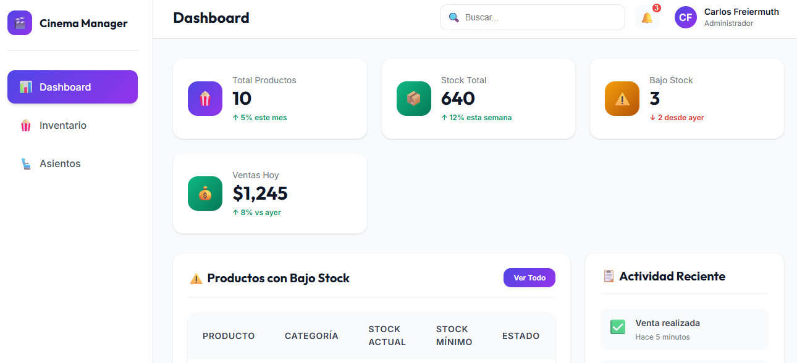
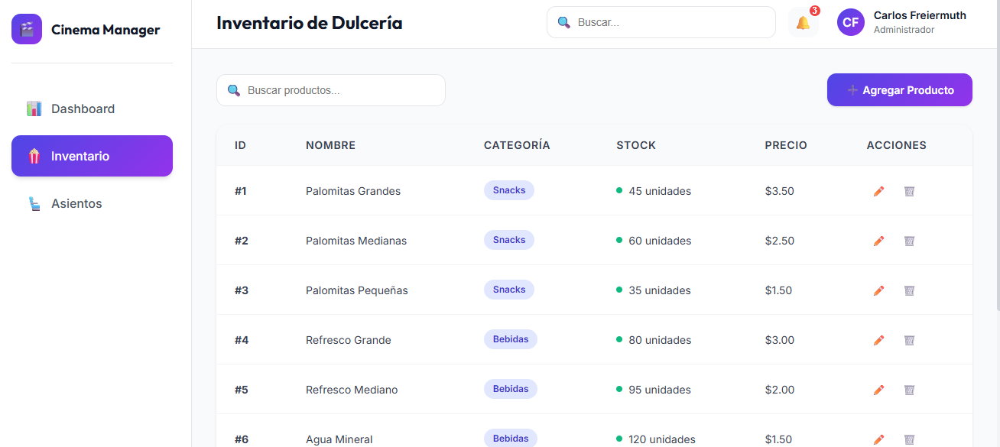
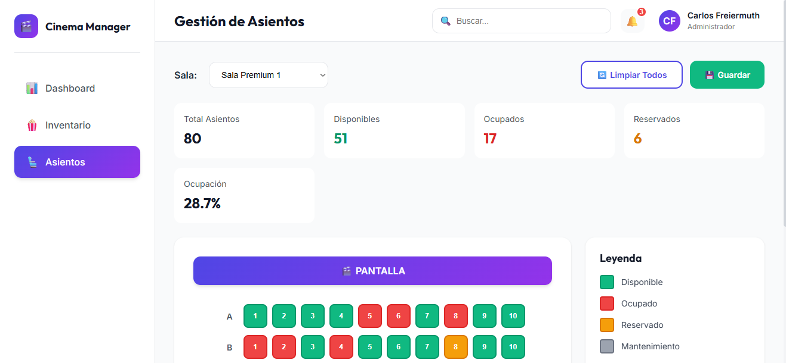

# WL Cinema Manager - Sistema de Gestión de Cines 🎬

**[⬅️ Volver al Portfolio](../readme.md)**

Sistema completo de gestión para cines con control de inventario de dulcería y administración interactiva de asientos. Mockup funcional white-label profesional con interfaz moderna y limpia.

---

## 📸 Screenshots

````carousel

<!-- slide -->

<!-- slide -->

````

---

## 🎯 Descripción

Mockup interactivo profesional de un sistema de gestión integral para cines. Cuenta con tres módulos principales: Dashboard con KPIs en tiempo real, Inventario de dulcería con alertas inteligentes de stock, y Gestión de asientos con mapas visuales de salas. Diseñado como solución white-label lista para personalizar e implementar.

**Características Destacadas:**
- ✨ Interfaz blanca profesional con glassmorphism y gradientes sutiles
- 📊 Dashboard gerencial con métricas en tiempo real
- 🍿 Sistema completo de inventario con categorización
- 💺 Mapas interactivos de asientos con 4 estados diferentes
- ⚡ SPA (Single Page Application) sin frameworks
- 📱 100% Responsive design

---

## 🎨 Stack Tecnológico

### Frontend
- **HTML5**: Estructura semántica y accesible
- **CSS3**: Variables CSS, Flexbox, Grid, Glassmorphism
- **JavaScript ES6+**: Vanilla JS (sin frameworks)
- **Tipografías**: Inter, Outfit (Google Fonts)

### Arquitectura
- **Patrón**: Single Page Application (SPA)
- **Routing**: Navegación interna basada en hash
- **Estado**: Gestión en memoria (LocalStorage ready)
- **Modularización**: Separación por responsabilidades (app.js, inventory.js, seats.js)

---

## 🚀 Funcionalidades Implementadas

### 📊 Dashboard Gerencial
- **KPIs en tiempo real**: Total productos, ventas diarias, ocupación de salas
- **Alertas de stock**: Productos con inventario bajo destacados
- **Estado de salas**: Visualización rápida de ocupación por sala
- **Actividad reciente**: Log de acciones del sistema
- **Tarjetas informativas**: Diseño moderno con iconografía

### 🍿 Inventario de Dulcería
- **CRUD completo**: Crear, leer, actualizar y eliminar productos
- **Búsqueda en tiempo real**: Filtro dinámico por nombre
- **Categorización**: Snacks, Bebidas, Comida, Dulces
- **Alertas de stock**: Indicadores visuales cuando stock < 20 unidades
- **Gestión de precios**: Control de precios unitarios
- **Indicadores visuales**: Badges de estado según nivel de inventario

### 💺 Gestión de Asientos
- **Selector de salas**: Navegación entre Sala 1 y Sala 2
- **Mapas interactivos**: Grilla visual de asientos (10 filas x 8 columnas)
- **4 Estados de asientos**:
  - ✅ **Disponible** (verde): Asiento listo para venta
  - ❌ **Ocupado** (rojo): Asiento vendido
  - ⏳ **Reservado** (amarillo): Asiento en proceso de compra
  - 🔧 **Mantenimiento** (gris): Asiento fuera de servicio
- **Cambio de estado con un click**: Interacción directa en el mapa
- **Estadísticas de ocupación**: Contador en tiempo real por estado
- **Layout realista**: Configuración de cine con pasillo central

---

## 📁 Estructura del Proyecto

```
design/mockup/
├── index.html              # Aplicación principal con estructura HTML
├── css/
│   ├── variables.css       # Sistema de diseño (colores, tipografía, espaciado)
│   ├── global.css          # Estilos globales y reset CSS
│   ├── components.css      # Componentes reutilizables (botones, cards, forms)
│   └── pages.css           # Estilos específicos de cada página
└── js/
    ├── app.js              # Lógica principal y enrutamiento SPA
    ├── inventory.js        # CRUD y gestión de inventario
    └── seats.js            # Gestión de asientos y salas
```

---

## 🔧 Cómo Usar

1. **Abrir el mockup**: Navegar a `design/mockup/index.html` en cualquier navegador moderno
2. **No requiere instalación**: Funciona directamente desde el sistema de archivos
3. **Navegación**:
   - **Dashboard**: Vista general con estadísticas
   - **Inventario**: Agregar/Editar/Eliminar productos
   - **Asientos**: Visualizar y cambiar estado de asientos
4. **Datos en memoria**: Los cambios se pierden al recargar (sin persistencia)

---

## 🔄 Roadmap - Próximos Pasos

Para evolucionar este mockup a una aplicación full-stack en producción:

### Backend
- **Node.js + Express** o **Python + Flask/Django**
- API RESTful con endpoints para:
  - Inventario (CRUD de productos)
  - Asientos (gestión de estados, reservas)
  - Ventas (transacciones, reportes)
  - Usuarios y roles (admin, cajero, gerente)

### Base de Datos
- **MongoDB**: Para flexibilidad de esquemas
- **PostgreSQL**: Para transacciones críticas
- Esquemas sugeridos: `products`, `rooms`, `seats`, `sales`, `users`

### Autenticación y Seguridad
- **JWT** para autenticación stateless
- **bcrypt** para hashing de contraseñas
- **Roles y permisos**: Admin, Gerente, Cajero

### Funcionalidades Adicionales
- Sistema de ventas (POS integrado)
- Gestión de películas, horarios y funciones
- Impresión de tickets (integración con impresoras térmicas)
- Dashboard analytics (gráficos Recharts/D3.js)
- Reportes exportables (PDF, Excel)
- Notificaciones en tiempo real (WebSockets)
- Integración con pasarelas de pago (Stripe, PayPal)

---

## 🎓 Habilidades Demostradas

| Categoría             | Detalles                                                                  |
| --------------------- | ------------------------------------------------------------------------- |
| **Frontend**          | HTML5 semántico, CSS3 avanzado (variables, glassmorphism), Vanilla JS     |
| **UX/UI Design**      | Interfaz profesional white-label, paleta de colores coherente, responsive |
| **Arquitectura**      | SPA sin frameworks, modularización, separación de responsabilidades       |
| **Lógica de Negocio** | CRUD, gestión de estado, validaciones, alertas inteligentes               |
| **Interactividad**    | Mapas interactivos, navegación fluida, feedback visual                    |

---

## 👨‍💻 Autor

**Carlos Guillermo Freiermuth Andino**
- **Email:** carlosfreiermuth@gmail.com
- **WhatsApp:** +593 99 9448 906
- **Empresa:** Freiermuth_Solutions
- **Ubicación:** Quito, Ecuador

---

## 📄 Licencia

Proyecto de demostración white-label - Freiermuth_Solutions © 2025

---

**[⬅️ Volver al Portfolio](../readme.md)**
