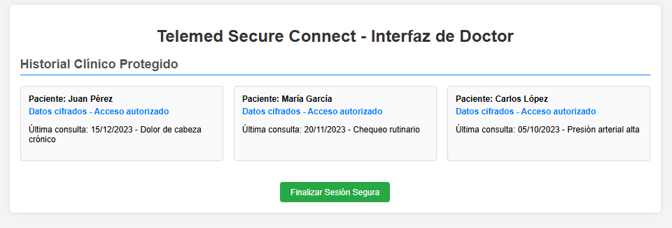
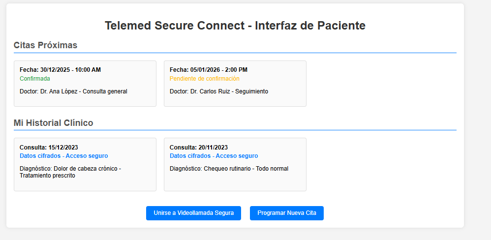

# 🏥 Telemed Secure Connect - Plataforma de Telemedicina Segura

**[⬅️ Volver a la Sección](../readme.md)**

**[🏠 Volver al Portfolio](../../readme.md)**

Plataforma de telemedicina con videollamadas cifradas, cumplimiento de privacidad de datos médicos y logs de acceso auditables. Incluye mockups funcionales para las interfaces de doctor y paciente.

---

## 📸 Screenshots

````carousel

<!-- slide -->

````

---

## 🎯 Descripción

**Telemed Secure Connect** es una plataforma integral de telemedicina diseñada para garantizar la máxima privacidad y seguridad en las consultas médicas virtuales. Utiliza videollamadas completamente cifradas y mantiene un cumplimiento estricto con regulaciones de privacidad de datos médicos, con logs auditables de todos los accesos.

El proyecto incluye mockups funcionales de las interfaces tanto para médicos como para pacientes, demostrando las capacidades de gestión de sesiones seguras y acceso controlado a historiales clínicos.

**Características Destacadas:**
- 🔒 Videollamadas con cifrado end-to-end
- 📋 Historial clínico protegido con acceso autorizado
- 📊 Logs auditables para cumplimiento normativo
- 👨‍⚕️ Interfaz especializada para profesionales médicos
- 👤 Portal paciente con gestión de citas y acceso personal

---

## 🎨 Stack Tecnológico

### Frontend (Mockups)
- **HTML5**: Estructuras semánticas para ambas interfaces
- **CSS3**: Diseño responsive con glassmorphism y gradientes
- **JavaScript ES6+**: Interactividad vanilla para prototipos

### Seguridad
- **Cifrado**: End-to-end para videollamadas
- **Autenticación**: Multi-factor para acceso médico
- **Auditoría**: Logs inmutables de todas las interacciones

---

## ✨ Características Principales

- ✅ **Videollamadas Cifradas** - Comunicación segura doctor-paciente
- ✅ **Historial Clínico Protegido** - Datos cifrados con control de acceso
- ✅ **Gestión de Citas** - Programación y recordatorios automáticos
- ✅ **Interfaz de Doctor** - Acceso a historiales y controles de sesión
- ✅ **Portal Paciente** - Vista personal de citas y registros médicos
- ✅ **Cumplimiento HIPAA/GDPR** - Privacidad y seguridad regulatoria
- ✅ **Logs Auditables** - Registro completo de accesos y cambios

---

## 🏥 Interfaces Desarrolladas

### Interfaz de Doctor
- **Historial Clínico**: Acceso autorizado a datos del paciente
- **Controles de Sesión**: Iniciar/finalizar consultas seguras
- **Notas Médicas**: Registro cifrado de diagnósticos
- **Programación**: Gestión de agenda y citas

### Interfaz de Paciente
- **Citas Próximas**: Vista de consultas programadas
- **Historial Personal**: Acceso a registros médicos propios
- **Videollamada**: Unirse a sesiones con un clic
- **Programar Cita**: Solicitud de nuevas consultas

---

## 🔒 Valor de Seguridad

- **Privacidad Médica**: Cumplimiento con estándares de salud
- **Cifrado End-to-End**: Comunicación completamente segura
- **Control de Acceso**: Autorización granular por rol
- **Auditoría Completa**: Trazabilidad de todas las acciones

---

## 📊 Mockups Funcionales

Los mockups incluyen prototipos interactivos que demuestran:
- Navegación fluida entre secciones
- Estados de carga y transiciones
- Controles de sesión simulados
- Diseño responsive para múltiples dispositivos

---