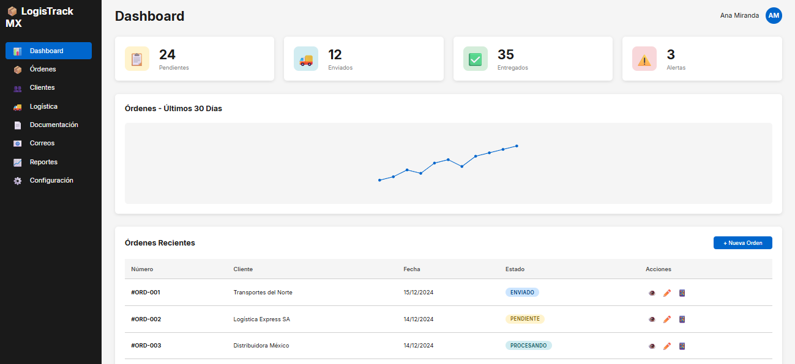

# 📦 LogisTrack - Sistema de Gestión Logística

**Sistema web completo para automatización de documentación logística y gestión de envíos.**

**[⬅️ Volver a la Sección](../readme.md)**

**[🏠 Volver al Portfolio](../../readme.md)**

> [!IMPORTANT]
> Este proyecto se encuentra **temporalmente pausado** debido a la suspensión del ciclo de pagos por parte del cliente. La documentación completa, diseño técnico y mockup funcional están completados y disponibles para revisión.

## 🎯 Descripción

LogisTrack es una solución integral diseñada para pequeñas y medianas empresas de logística en México que buscan automatizar procesos manuales de documentación y mejorar la eficiencia operacional. El sistema centraliza la gestión de órdenes, clientes, rutas de transporte y generación de documentación.

## ✨ Características Principales

- ✅ **Generación Automática de Listas de Empaque** - Procesamiento de grandes volúmenes de documentación
- ✅ **Lectura por Códigos QR** - Escaneo rápido de órdenes para agilizar procesos
- ✅ **Base de Datos de Clientes** - Requisitos personalizados y preferencias por cliente
- ✅ **Base de Datos de Rutas** - Tarifas y tiempos de entrega de transportistas
- ✅ **Integración con Email** - Clasificación automática de órdenes por IMAP
- ✅ **Dashboard Gerencial** - KPIs, reportes y monitoreo en tiempo real
- ✅ **Comparador de Transportistas** - Selección óptima según destino y tarifas
- ✅ **Sistema Multiusuario** - Roles y permisos personalizados

## 🛠️ Stack Tecnológico

| Componente     | Tecnología                      |
| -------------- | ------------------------------- |
| **Frontend**   | React.js + Vite + Material-UI   |
| **Backend**    | Node.js + Express + TypeScript  |
| **Base Datos** | PostgreSQL                      |
| **Storage**    | Cloudflare R2 / AWS S3          |
| **Email**      | Nodemailer + IMAP               |
| **Hosting**    | Render / Railway / DigitalOcean |

## 📊 Módulos del Sistema

### 🏠 Dashboard
- Vista general de operaciones diarias
- KPIs de eficiencia y procesamiento
- Alertas y notificaciones en tiempo real
- Resumen de órdenes pendientes

### 📋 Gestión de Órdenes
- Importación automática desde email
- Generación de listas de empaque
- Códigos QR por orden
- Trazabilidad completa

### 👥 Base de Datos de Clientes
- Requisitos específicos por cliente
- Preferencias de documentación
- Historial de envíos
- Contactos y direcciones

### 🚛 Gestión de Rutas
- Catálogo de transportistas
- Tarifas por ruta y zona
- Tiempos estimados de entrega
- Comparador automático

### 📧 Sistema de Email
- Lectura automática de bandeja IMAP
- Clasificación por cliente/tipo
- Extracción de datos de órdenes
- Confirmaciones automáticas

### 📈 Reportes y Analytics
- Análisis de volumen de envíos
- Comparativa de transportistas
- Eficiencia operacional
- Exportación de datos

## 🎨 Demostración Visual

### Dashboard Principal

*Vista general del dashboard con métricas de órdenes, rutas activas y comparador de transportistas.*

## 💼 Beneficios Esperados

| Métrica                    | Mejora Estimada     |
| -------------------------- | ------------------- |
| Tiempo de procesamiento    | -60% a -70%         |
| Errores de documentación   | -80% a -90%         |
| Tiempo de respuesta        | -50%                |
| Capacidad de procesamiento | +100% sin contratar |

## 📊 Habilidades Demostradas

- 📦 Logistics & supply chain domain knowledge
- 📧 Email automation (IMAP integration)
- 🏗️ Full-stack application architecture
- 📊 Business process optimization
- 🎨 Complex dashboard design
- 🔄 Real-time data synchronization
- 📱 QR code generation and scanning
- 🗄️ Database design (11 tables)

## 🇲🇽 Características México

- ✅ Localización completa en español mexicano
- ✅ Formato de direcciones y zonas de México
- ✅ Integración con transportistas locales
- ✅ Normativas de documentación comercial
- ✅ Consideraciones de zonas de entrega

## 📅 Estado del Proyecto

**Fase Actual:** Desarrollo Pausado  
**Progreso:** Documentación técnica completa, mockup funcional  
**Duración Estimada MVP:** 13 semanas  
**Duración Total:** ~21 semanas (5 meses)

### Documentación Disponible:
- ✅ Visión general del proyecto
- ✅ Diseño técnico completo (11 tablas, APIs, seguridad)
- ✅ Diseño UI/UX con paleta de colores y componentes
- ✅ Roadmap de desarrollo (14 sprints)
- ✅ Propuesta comercial con 3 opciones de pricing
- ✅ Mockup funcional interactivo (HTML/CSS/JS)

---

[Volver al Portfolio](../)
