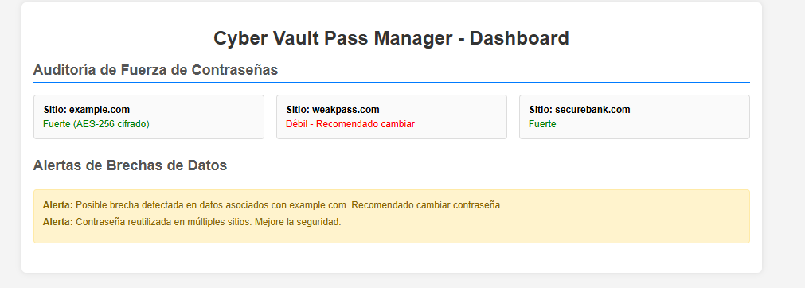

# 🔐 Cyber Vault Pass Manager - Administrador de Contraseñas Empresarial

**[⬅️ Volver al Portfolio](../readme.md)**

Sistema SaaS de gestión de contraseñas empresarial con arquitectura zero-knowledge y cifrado AES-256 del lado del cliente. Incluye mockup funcional del dashboard con auditoría de fuerza de contraseñas y alertas de brechas de datos.

---

## 📸 Screenshots

````carousel

````

---

## 🎯 Descripción

**Cyber Vault Pass Manager** es una solución SaaS para la gestión segura de contraseñas empresariales, implementando una arquitectura zero-knowledge que garantiza que ni siquiera el proveedor puede acceder a los datos del usuario. El cifrado AES-256 se realiza completamente del lado del cliente, asegurando máxima privacidad y seguridad.

Este proyecto incluye un mockup funcional del dashboard principal, demostrando las capacidades de auditoría de fuerza de contraseñas y sistema de alertas de brechas de datos.

**Características Destacadas:**
- ✨ Arquitectura zero-knowledge para privacidad total
- 🔐 Cifrado AES-256 del lado del cliente
- 📊 Dashboard con métricas de seguridad en tiempo real
- 🚨 Sistema de alertas inteligentes para brechas de datos
- 🏢 Enfoque empresarial con gestión de equipos

---

## 🎨 Stack Tecnológico

### Frontend (Mockup)
- **HTML5**: Estructura semántica del dashboard
- **CSS3**: Diseño moderno con Flexbox y Grid
- **JavaScript ES6+**: Interactividad vanilla

### Seguridad
- **Cifrado**: AES-256 del lado del cliente
- **Arquitectura**: Zero-knowledge proof
- **Autenticación**: Basada en criptografía

---

## ✨ Características Principales

- ✅ **Auditoría de Fuerza de Contraseñas** - Evaluación automática con algoritmos avanzados
- ✅ **Alertas de Brechas de Datos** - Integración con bases de datos de brechas públicas
- ✅ **Gestión de Equipos** - Compartir contraseñas de forma segura entre miembros
- ✅ **Generador de Contraseñas** - Creación de contraseñas fuertes y únicas
- ✅ **Sincronización Multi-Dispositivo** - Acceso desde cualquier dispositivo
- ✅ **Backup Seguro** - Copias de seguridad cifradas

---

## 🔒 Valor de Seguridad

- **Zero-Knowledge**: El servidor nunca ve las contraseñas en texto plano
- **Cifrado Cliente-Side**: Todas las operaciones criptográficas ocurren localmente
- **Auditoría Completa**: Logs detallados de acceso y cambios
- **Cumplimiento**: Alineado con estándares como GDPR y HIPAA

---

## 📊 Dashboard Mockup

El mockup incluye:
- **Métricas de Seguridad**: Porcentaje de contraseñas fuertes vs débiles
- **Alertas Activas**: Notificaciones de brechas detectadas
- **Lista de Contraseñas**: Vista organizada con indicadores de fuerza
- **Controles de Usuario**: Opciones de configuración y gestión

---