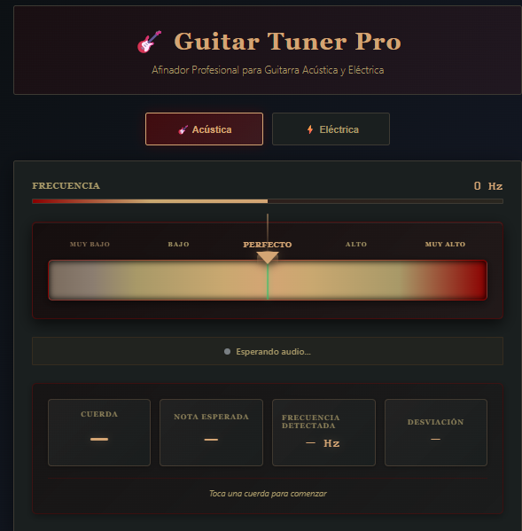

# 🎸 Afinador de Guitarra en Línea

**Aplicación web para afinar guitarras en tiempo real usando el micrófono del dispositivo.**

**[⬅️ Volver a la Sección](../readme.md)**

**[🏠 Volver al Portfolio](../../readme.md)**

## 🎯 Descripción

Afinador de guitarra profesional basado en web que utiliza la Web Audio API para detectar y analizar frecuencias en tiempo real. La aplicación permite afinar guitarras acústicas y eléctricas directamente desde el navegador sin necesidad de instalar software adicional.

## ✨ Características Principales

- ✅ **Detección Automática de Notas** - Reconocimiento de frecuencias en tiempo real
- ✅ **Afinación Estándar (EADGBE)** - Soporte completo para las 6 cuerdas
- ✅ **Indicador Visual de Precisión** - Feedback visual de afinación
- ✅ **Modo Cromático** - Detección de todas las notas musicales
- ✅ **Compatibilidad Universal** - Funciona en cualquier navegador moderno
- ✅ **Sin Instalación Requerida** - 100% basado en navegador
- ✅ **Diseño Responsivo** - Optimizado para móvil, tablet y desktop
- ✅ **Interfaz Intuitiva** - Fácil de usar para principiantes y profesionales

## 🛠️ Stack Tecnológico

| Componente        | Tecnología                   |
| ----------------- | ---------------------------- |
| **Frontend**      | HTML5, CSS3, JavaScript ES6+ |
| **Audio API**     | Web Audio API                |
| **Procesamiento** | FFT (Fast Fourier Transform) |
| **UI/UX**         | CSS Variables, Flexbox       |

## 🎵 Funcionalidades

### 🎼 Detección de Frecuencias
- Análisis de audio en tiempo real mediante FFT
- Precisión de ±1 Hz
- Rango de detección: 82 Hz - 330 Hz
- Actualización continua cada 100ms

### 🎯 Indicador Visual
- Barra de precisión con código de colores
- Verde: Afinado correctamente
- Amarillo: Ligeramente desafinado
- Rojo: Requiere ajuste
- Indicador numérico de desviación en cents

### 🎸 Modos de Afinación
- **Estándar:** E2, A2, D3, G3, B3, E4
- **Cromático:** Todas las 12 notas
- Selección manual de cuerda
- Auto-detección de cuerda más cercana

## 🎨 Demostración Visual

### Vista Principal

*Interfaz principal del afinador con detección de nota activa y barra de precisión.*

### Funcionalidades

*Selector de cuerdas, modo cromático y controles de sensibilidad.*

## 📊 Habilidades Demostradas

- 🎵 Web Audio API y procesamiento de señales
- 📊 Análisis de frecuencias (FFT)
- 🎨 UI/UX para herramientas musicales
- 📱 Diseño responsivo cross-platform
- ⚡ Performance optimization para procesamiento en tiempo real
- 🎯 Algoritmos de detección de pitch
- 🔊 Manejo de permisos de micrófono

## 🌐 Compatibilidad

- ✅ Chrome / Edge 70+
- ✅ Firefox 65+
- ✅ Safari 14+
- ✅ Android Chrome 80+
- ✅ iOS Safari 14+

## 🎼 Notas Técnicas

### Algoritmo de Detección
- Utiliza autocorrelación para detección de pitch
- FFT de 2048 samples para análisis espectral
- Filtrado de ruido ambiente
- Calibración a 440 Hz (A4)

### Precisión
- Rango de detección: ±50 cents
- Precisión visual: ±1 cent
- Latencia: < 100ms

---

[Volver al Portfolio](../)
