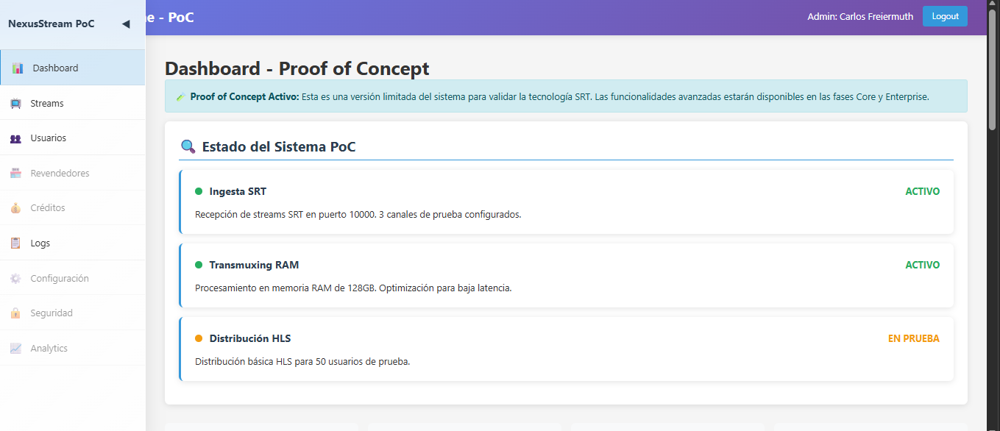
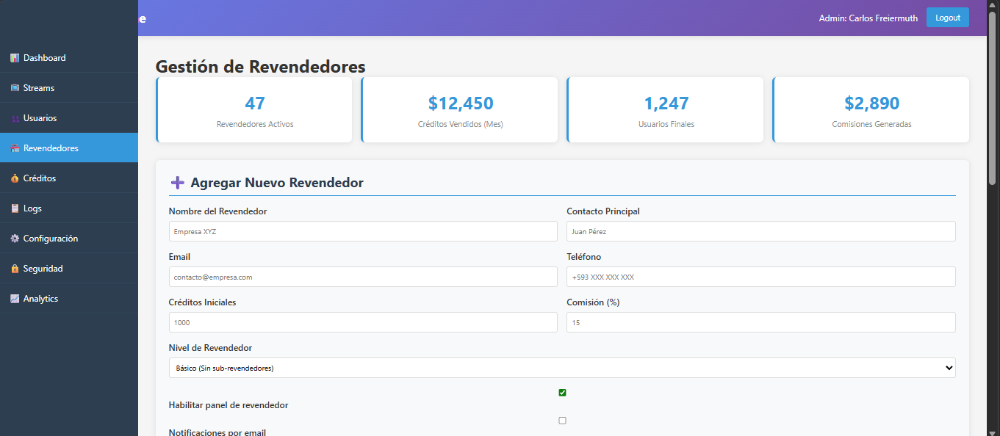

# 📺 Nexus SRT High-Performance IPTV Engine

**Infraestructura privada de streaming IPTV de baja latencia y alta disponibilidad, optimizada para servidores de alto rendimiento con protocolo SRT.**

**[⬅️ Volver a la Sección](../readme.md)**

**[🏠 Volver al Portfolio](../../readme.md)**

## 🎯 Descripción

**Nexus SRT Engine** es una solución completa para el mercado de IPTV que combina tecnología de vanguardia con un modelo de negocio sostenible. Diseñado para gestionar redes masivas de subventa con estándares avanzados de seguridad, control de propiedad intelectual y alta disponibilidad.

## ✨ Características Principales

- ✅ **Protocolo SRT**: Transmisión segura y confiable con corrección de errores
- ✅ **Transcodificación en RAM**: Procesamiento ultra-rápido sin disco
- ✅ **Multi-protocolo**: Soporte para SRT, RTMP, HLS, DASH
- ✅ **ABR (Adaptive Bitrate)**: Calidades automáticas (1080p, 720p, 480p)
- ✅ **Sistema de Revendedores**: Gestión de créditos y comisiones multinivel
- ✅ **DRM y Seguridad**: Encriptación, tokens dinámicos, anti-piratería
- ✅ **Alta Disponibilidad**: Redundancia ISP, balanceo geográfico
- ✅ **Panel Web**: Interfaz completa para administración

## 🛠️ Stack Tecnológico

| Componente | Tecnología |
|-----------|-----------|
| **Backend** | Docker, Docker Compose |
| **Streaming** | SRT Tools, FFmpeg |
| **Servidor Web** | Nginx/Apache |
| **Base de Datos** | PostgreSQL, Redis |
| **Sistema Operativo** | Ubuntu 22.04 LTS |
| **Lenguajes** | Bash, HTML5, CSS3, JavaScript |
| **Despliegue** | Scripts de automatización |

## 🎨 Diseño Visual

- **PoC Dashboard**: Interfaz limitada para validación técnica
- **Panel Administrativo**: Gestión completa de streams y revendedores
- **Panel de Usuario**: Interfaz premium para suscriptores
- **Analytics**: Reportes y métricas avanzadas
- **Paleta**: Diseño profesional y responsivo

## 📸 Demostración Visual

### PoC Dashboard

*Dashboard limitado para validación técnica SRT.*

### Panel de Revendedores

*Gestión de revendedores y sistema de comisiones.*

### Panel de Usuario Final

*Interfaz premium para suscriptores del servicio.*

## 📊 Habilidades Demostradas

- 🔧 DevOps & Infraestructura
- 📡 Protocolos de streaming (SRT, HLS, DASH)
- 🐳 Contenedorización con Docker
- 💾 Optimización de hardware (RAM Disk)
- 🔒 Seguridad y DRM
- 📊 Arquitectura de sistemas distribuidos
- 💼 Modelos de negocio SaaS

## 🚀 Cómo Usar

### Validación del Sistema
1. Transfiere los scripts a tu servidor Ubuntu
2. Ejecuta `./validate_system.sh` para verificación completa
3. Configura RAM Disk y puertos según documentación

### Explorar Mockups
1. Abre los archivos `.html` en `mockup/` con un navegador
2. O usa servidor local: `python -m http.server 8000`
3. Navega entre las diferentes interfaces

### Instalación Básica
```bash
# Instalar Docker
curl -fsSL https://get.docker.com -o get-docker.sh
sudo sh get-docker.sh

# Configurar firewall
sudo ufw allow 80/tcp
sudo ufw allow 443/tcp
```

## 📋 Fases del Proyecto

| Fase | Alcance | Presupuesto |
|------|---------|-------------|
| **PoC** | Validación SRT con 50 usuarios | $400 USD |
| **Core** | Panel admin y gestión | $8,000 - $12,000 USD |
| **Enterprise** | Redundancia total y apps | $20,000+ USD |

---

[Volver al Portfolio](../)